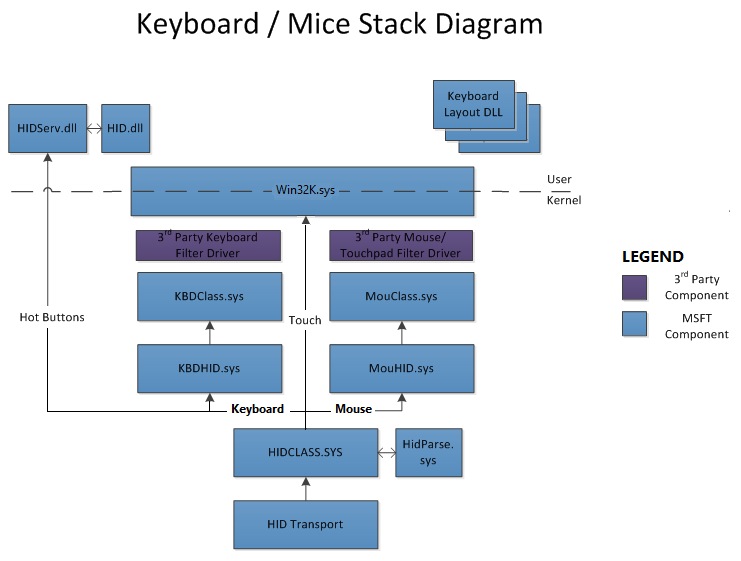
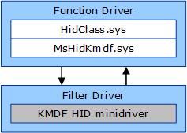

# Virtual mouse driver and client

This project aimed to figure out a way to create a virtual mouse driver. Such a driver could be accessed through a user-mode app, which could take control over cursor movement. 

# 1. HID Component Architecture
The first thing required to comprehensively understand the principles of the project is the design of the HID-compliant device and HID architecture in Windows operating system.

## 1.1. HID Definition
The main aim of the HID specification was to simplify the mechanism of installation new I/O devices to the computer. A driver uses self-describing packets called descriptors. HID driver on the host device can process and dispatch descriptors further up the driver stack to the HID client layer. Later, HID clients use the data from the descriptors to achieve their specific goals. One of the main ideas behind the HID was to unify the interface of the similar devices used to communicate between humans and computers. To achieve it HID protocol defines a range of supported devices through special classes defined in the "*Device Class Definition for HID 1.11*" document. One of the fundamental classes is computer mouse defining I/O descriptors exchanged between a device - mouse and a host - computer. 

## 1.2. HID Archtecture in Windows
Windows has its own HID driver stack shared with programmers. It allows creating drivers either on the kernel or user mode level. The HID drivers architecture is depicted well on the below model

The main component delivered by an operating system responsible for HID support is HID Class driver - "HIDCLASS.sys". Firstly, HID Class is an abstraction layer accountable for unifying computer communication with various hardware device's interfaces through HID. In the picture, different hardware interfaces are collectively named HID Transport modules. These modules are called HID minidrivers and perform as proxies between specific hardware implementations and HID Class interface. HID Class driver is called in HID Clients, which are created independently of the hardware. HID Clients can identify devices to work with through a unique Hardware ID. Hardware IDs are given to the devices during the enumeration process in the HIDClass.sys. Clients can communicate with HID Class in two ways. The first, available in user mode, is a set of methods called "HidD_xxx" shared by HID Class. The second one available for kernel and user is a set of `IOCTL_HID` operations. 

From the project perspective, the most interesting HID client is MouHID.sys, it is a lower filter for MouClass.sys and is responsible for interactions with available HID devices compatible with Device Class defined for computer mouses. MouHID.sys stores data about all of the mouses and sends necessary info from exchanged HID Reports up to MouClass.sys queue. This queue is later used for completing awaiting read requests(`IRP_MJ_READ`) through transfer to the system input queue. Later on, the system's task communicates with other working processes and informs about the new cursor position. 

## 1.3. Architecture of HID transport layer drivers - HID minidrivers

HID minidrivers are a proxy between physical interfaces and HID Class. The first step which minidrvier needs to make is a registration in the HID Class using HidRegisterMinidriver(). The copy of the access points to the standard minidrivers methods is saved during enumeration. In the next step, the minidriver' access points are replaced with ones, delivered by HID Class. New access points contain methods such as `AddDevice()`, `Unload()` and requests dispatching operations: `IRP_MJ_CREATE`, `IRP_MJ_CLOSE`, `IRP_MJ_DEVICE_CONTROL` and others. Moreover, HID Class is responsible for the allocation of the memory for the minidriver. HID Class creates an FDO(Functional Deice Object) describing device from HID perspective. Minidriver is also obliged to implement IO request queues transferred to HID Class and handling of the IOCTL methods required by the IOCTL protocol.

It's worth mentioning HID Class and WDF(Windows Driver Framework) deliver a similar set of WDM commands such as "Plug and  Play" or "PnP". Because of that conflict, Microsoft created WDM driver named MsHidKmdf.sys, which plays the role of a proxy between HIDClass and minidrivers. Minindriver works as a lower filter for MsHidKmdf.sys. MsHidKmdf.sys registers a new device(FDO) on minidriver's behalf in HID Class. After enumeration, it begins to pass through all of the I/O requests to the minidriver. The architecture of such a solution is depicted below.

## 2. Proposed solution

The proposed solution is a creation of a new HID minidriver in the transport layer, which will imitate a physical mouse connected to the host. The report descriptors will be hardcoded inside the driver so the HID Class will recognize it as a computer mouse. To achieve it is needed to define the design of the report descriptor for the Device Class corresponding to the mouse in the "Device Class Definition for HID 1.11" specification. Because of the conflict between HID Class and WDF, it will be required to use a proxy - MsHidKmdf.sys. That is why minidriver will be a lower filter for the proxy. To avoid handling unnecessary requests such as power management, the driver will be defined as Filter Driver.

Such virtual device is registered in HID Class and can be accessed from User mode. The client app can detect and communicate with the driver. The client can send output reports defined in HID. Reports contain packets with data regarding cursor movement. Reports are addressed to the physical device, but the driver will take over them, repack to the Input Report and send back up the driver stack to the HID Class who will treat it as data from the mouse and pass it to the MouHID.sys and later to the MouClass.sys. MouClass.sys will propagate the fake mouse movement info through the operating system. 

## 3. Bibliography
[www.usb.org/document-library/device-class-definition-hid-111](https://www.usb.org/document-library/device-class-definition-hid-111) 
[www.docs.microsoft.com/en-us/windows-hardware/drivers/hid/](https://docs.microsoft.com/en-us/windows-hardware/drivers/hid/) 
[www.docs.microsoft.com/en-us/windows-hardware/drivers/wdf/](https://docs.microsoft.com/en-us/windows-hardware/drivers/wdf/) 
[www.tracesystemsinc.com/USB_Tutorials_web/USB/B1_USB_Classes/Books/A3_A_Closer_Look_at_HID_Class/slide01.htm](https://www.tracesystemsinc.com/USB_Tutorials_web/USB/B1_USB_Classes/Books/A3_A_Closer_Look_at_HID_Class/slide01.htm) 
[www.ravikiranb.com/tutorials/generic-comm-usb-hid/](https://ravikiranb.com/tutorials/generic-comm-usb-hid/) 
[www.docs.microsoft.com/en-us/windows-hardware/drivers/ddi/_hid/#hidclass-support-routines](https://docs.microsoft.com/en-us/windows-hardware/drivers/ddi/_hid/#hidclass-support-routines) 